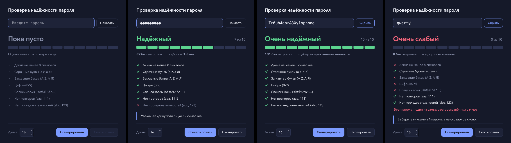

# Password Checker

Настольное приложение для проверки надёжности пароля. Написано на C++20 и Qt 6.



## Скачать

Готовые сборки лежат в разделе **[Releases](../../releases/latest)**:

- **Windows** — `PasswordChecker-windows-x64.zip`: распаковать и запустить `PasswordChecker.exe`
- **macOS** — `PasswordChecker-macos.zip`: распаковать и открыть `PasswordChecker.app`

### Первый запуск

Сборки не подписаны сертификатом разработчика, поэтому система покажет предупреждение. Это стандартное поведение для любого неподписанного приложения, а не признак вируса.

- **Windows:** в окне SmartScreen нажмите «Подробнее» → «Выполнить в любом случае».
- **macOS:** щёлкните по приложению правой кнопкой → «Открыть» → «Открыть». Если macOS пишет, что приложение повреждено, снимите карантин в терминале:

  ```bash
  xattr -cr ~/Downloads/PasswordChecker.app
  ```

## Возможности

- Оценка обновляется по мере ввода, без кнопки «Проверить»
- Шкала надёжности и словесный вердикт: от «Очень слабый» до «Очень надёжный»
- Список из семи критериев с отметками, что выполнено, а что нет
- Оценка энтропии в битах и примерное время подбора перебором
- Совет — одно конкретное действие, которое сильнее всего усилит пароль
- Проверка по списку самых распространённых паролей
- Генератор надёжных паролей длиной от 12 до 64 символов
- Поддержка кириллицы

## Как считается оценка

Максимум — 10 баллов.

| Критерий | Баллы |
|---|---|
| Длина ≥ 8 / ≥ 12 / ≥ 16 символов | +2 / +3 / +4 |
| Строчные буквы | +1 |
| Заглавные буквы | +1 |
| Цифры | +1 |
| Спецсимволы | +1 |
| Нет трёх одинаковых символов подряд (`aaa`, `111`) | +1 |
| Нет последовательностей (`abc`, `123`, `cba`) | +1 |
| Пароль из списка популярных | → 0 баллов |

| Баллы | Вердикт |
|---|---|
| 0–2 | Очень слабый |
| 3–4 | Слабый |
| 5–6 | Средний |
| 7–8 | Надёжный |
| 9–10 | Очень надёжный |

Энтропия считается как `длина × log₂(размер алфавита)`, где алфавит складывается из использованных классов символов. Время подбора — при скорости 10¹⁰ попыток в секунду.

## Сборка из исходников

Нужны CMake ≥ 3.29, компилятор с поддержкой C++20 и Qt 6.

**macOS (Homebrew):**

```bash
brew install qt
cmake -S . -B build
cmake --build build
open build/PasswordChecker.app
```

**Windows / Linux:** установите Qt 6 и укажите путь к нему:

```bash
cmake -S . -B build -DCMAKE_PREFIX_PATH=/path/to/Qt/6.8.2/<platform>
cmake --build build --config Release
```

## Структура проекта

| Файл | Назначение |
|---|---|
| `PasswordChecker.h/.cpp` | Логика анализа и генерации паролей, не зависит от UI |
| `MainWindow.h/.cpp` | Главное окно, вёрстка и стили |
| `StrengthMeter.h/.cpp` | Сегментированная шкала надёжности с анимацией |
| `main.cpp` | Точка входа, тема и шрифты |
| `.github/workflows/build.yml` | Автосборка `.exe` и `.app` в GitHub Actions |
